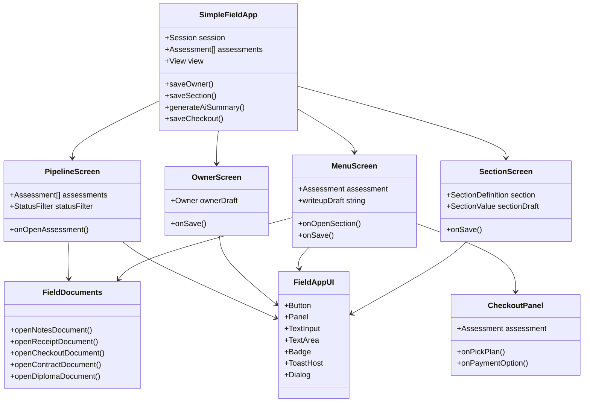
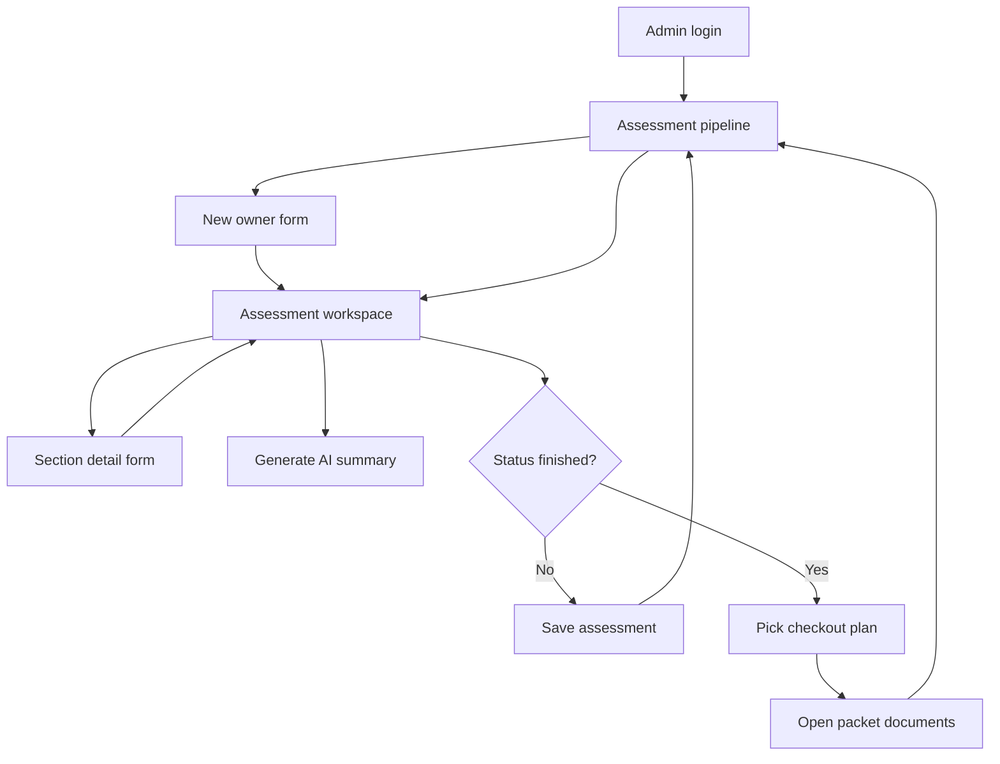

# HomeSHINE UI Architecture

## Design Pattern

The field app now follows a lightweight **controller + presentational components** pattern:

- `components/simple-field-app.tsx` owns state, API calls, routing between app views, and business events.
- `components/field-app/ui.tsx` contains reusable UI primitives such as panels, buttons, inputs, badges, toasts, and dialogs.
- `components/field-app/utils.ts` contains display helpers, checkout plan constants, status labels, and small formatting helpers.
- `lib/field-app-documents.ts` owns printable document generation, so customer packet markup is separate from the interactive UI.
- `lib/simple-field.ts` remains the domain model and static field definitions.

This keeps the app readable without adding a heavy state-management framework.

## Component UML

## User Flow UML

## Responsive Intent

The UI is phone-first, with single-column forms and full-width actions on smaller screens. Tablets keep compact panels and switch important grids to two columns where there is room. Desktop uses a constrained content width so the field workflow stays scannable instead of stretching edge to edge.
